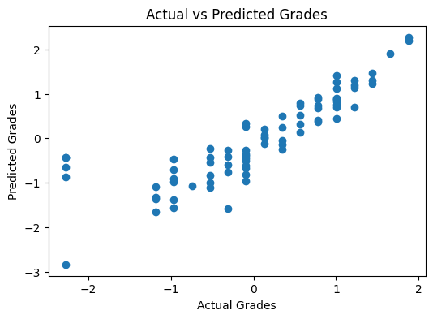

# 🎓 Student Performance Prediction using Supervised Machine Learning

This project applies supervised machine learning techniques to predict students' final academic performance based on educational and social factors.

The goal is to understand which factors influence student outcomes and evaluate the effectiveness of a Linear Regression model in predicting final grades.

---

## 📊 Dataset
- **Source**: UCI Machine Learning Repository – Student Performance Dataset
- **Records**: 395 students
- **Features**: Demographic, social, and academic attributes
- **Target Variable**: `G3` (Final Grade)

Each row represents a student, and each column represents a specific characteristic such as study time, previous grades, failures, and absences.

---

## 🧠 Methodology
The workflow of the project includes:

1. Loading and exploring the dataset
2. Visualizing key relationships between variables
3. Encoding categorical features using one-hot encoding
4. Scaling numerical features using StandardScaler
5. Splitting the data into training and testing sets
6. Training a Linear Regression model
7. Evaluating model performance
8. Visualizing predictions and correlations

---

## 📈 Data Visualization
The following visualizations were created to better understand the data and model performance:

### 🔹 Distribution of Final Grades

### 🔹 Study Time vs Final Grade

### 🔹 Correlation Heatmap

### 🔹 Actual vs Predicted Grades

---

## 🤖 Model Used
- **Algorithm**: Linear Regression
- **Why Linear Regression?**
  - Simple and interpretable
  - Suitable for continuous target variables
  - Ideal for baseline supervised learning models

---

## 📐 Evaluation
Model performance was evaluated using:
- **Mean Squared Error (MSE)**
- **R² Score**

The results indicate that previous academic performance (G1 and G2) is the strongest predictor of final grades.

---

## 🔍 Key Insights
- Previous grades have a strong positive correlation with final performance.
- Study time shows a positive but non-linear relationship with grades.
- Academic failures negatively impact final results.
- The Linear Regression model captures the general trend in student performance.

---

## 🛠️ Technologies Used

  

---

## 🚀 How to Run
1. Open the notebook in Google Colab
2. Run cells sequentially from top to bottom
3. Ensure required libraries are installed
4. Review visualizations and results

---

## 📌 Future Improvements
- Try other regression models (Ridge, Lasso)
- Convert the problem into classification (Pass / Fail)
- Perform feature selection and hyperparameter tuning
- Deploy the model as a simple web application

---

## 👤 Author
Abdullah Omar Akram AL‑Saffar

Github: [@AbdullahOmarAL-Safar](https://github.com/AbdullahOmarAL-Safar)

Linkedin: [Click me](https://www.linkedin.com/in/itsabdullahomar/)
